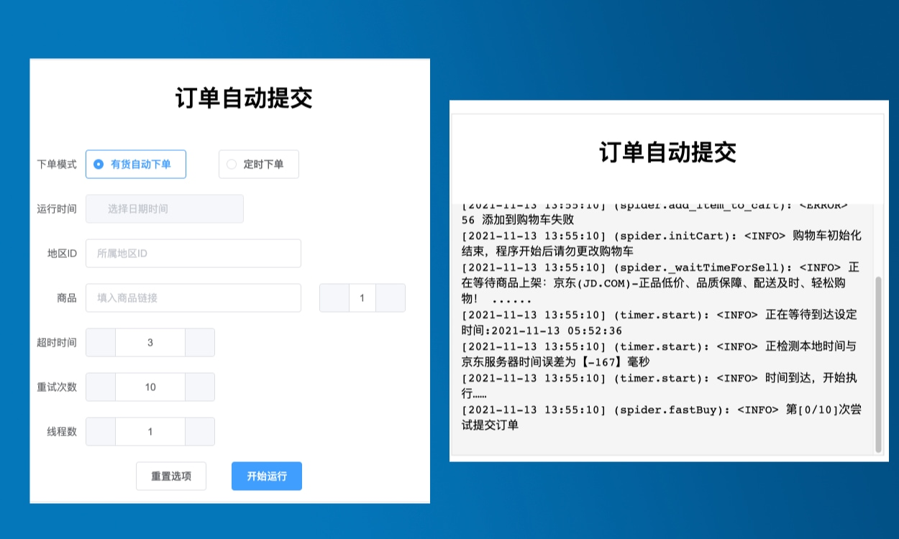

# JD_SHOPPER 

[](https://www.python.org/download/releases/3.4.0/)
[](https://github.com/tychxn/jd-assistant)
[](./LICENSE)
[](https://github.com/tychxn/jd-assistant)

### [🇨🇳 zh](./README.md) &emsp; [🇺🇸 en](./README.en.md)

Jingdong snapping assistant

1. Out of stock, automatically add to the shopping cart to place an order

2. Add the shopping cart regularly to place an order



## The main function

- Out of the box software (windows only)
- web interface (cross-platform)
- Log in to Jingdong Mall ([www.jd.com](http://www.jd.com/))
    - Mobile phone scan code login
    - save/load login cookies (verify if cookies expire)
- Commodity query operation
    - Provide complete [`address⇔ID`](./area_id/) correspondence
    - Query inventory based on item ID and address ID
    - Query price based on product ID
- Shopping cart operation
    - Empty/Add to shopping cart (out-of-stock items can also be added to the shopping cart, but pre-ordered items cannot be added)
    - Get shopping cart item details
- Order operations
    - Get order settlement page information (product details, total payable, delivery address, consignee, etc.)
    - Submit order (use default address)
- other
    - Product reservation
    - User information query

## recent updates

[View detailed log](./Docs/change-log.md)

### v1.0.1

- Fixed an issue where fonts and icons were displayed incorrectly
- Preliminary configuration of local GUI program
- Modify the readme and document structure

### v1.1.0
- Online Windows out-of-the-box exe program
- Fix windows web ui display bug
- Update the self-packaging method of readme

### v1.1.1

Thanks to [@laodiaoyadashu](https://github.com/laodiaoyadashu) and [@YuTao0310](https://github.com/YuTao0310) for their contributions to this project

-Fixed that the in-stock item keeps prompting waiting to be put on the shelves
- Fixed cookie not being created correctly when username is too long
- Remove useless functions and fix wrong function parameters

### coming soon
- Automatic order placement function when the online price is lower than the set value

## Special statement:

**Must read** before using this repository -- [*Instructions*](./Docs/notice.md)
> ***If you use or copy any code or project made by this repository, you will be deemed to `accepted` this statement, please read it carefully***  
> ***You have used or copied any code or project made by this warehouse and I am still using it at the time when this statement is not issued, it is deemed to `accepted` this statement, please read it carefully***

## quick start

### run via *windows program*
> [Click me to download the program zip package directly](https://gitee.com/louisyoungx/JD-SHOPPER/attach_files/888014/download/jd-shopper.zip)
1. Go to the release interface to download the jd-shopper.zip package
2. After decompression, find the jd-shopper.exe file in the jd-shopper directory
3. Click Run, or right-click to generate a shortcut and run
> Tip: If the interface is blank after opening, you can try to open [http://localhost:12021/](http://localhost:12021/) in the browser

### run from *source code*

#### runtime environment

- [Python 3](https://www.python.org/)

#### Third Party Libraries

- [Requests](http://docs.python-requests.org/en/master/)
- [Beautiful Soup](https://www.crummy.com/software/BeautifulSoup/bs4/doc/)
- [lxml](https://lxml.de)

Install:

````sh
pip install -r requirements.txt
````

Tips:
>
> If the domestic installation of third-party libraries is slow, you can use the following commands to accelerate Tsinghuayuan:
> ```sh
> pip install -r requirements.txt -i https://pypi.tuna.tsinghua.edu.cn/simple/
> ````
>
> Also try if the installation is wrong
> ```sh
> pip install requests lxml bs4
> ````

### *web* interface - tutorial

1. Recommended **Chrome** browser
2. Go to the */TEST/area_id/* directory to query the area ID of your location
3. If your account has **Jingdoujing coupon balance**, please go to */Config/config.ini* to set the password, or run with another account
4. Run the service from the command line

```shell
python3 runserver.py
````

> **Note**: If there is no response in Windows environment, you can try
>
> ```shell
> python runserver.py # Caused by Python environment problems
> ````

5. Open the browser http://localhost:12021/

### *command line* - tutorial

#### 1. The new version of the web interface is not stable, maybe the command line is more suitable

#### 2. Web page scan code login, or account password login

#### 3. Fill in the config.ini configuration information

(1) `eid` and `fp` find a common product and place an order casually, and then grab the package to see, these two values ​​can be filled in fixed
> Find any product to place an order, then go to the settlement page, open the browser's debug window, switch to the console Tab page, and enter the variable `_JdTdudfp` in the console, you can get `eid` and `fp from the output Json `.  
> If not, please refer to author 3's 👉 [Please refer to Wiki for usage tutorials](https://github.com/tychxn/jd-assistant/wiki/1.-%E4%BA%AC%E4%B8%9C%E6 %8A%A2%E8%B4%AD%E5%8A%A9%E6%89%8B%E7%94%A8%E6%B3%95)

> *Students who do not know can also open the `get_eid_fp.html` file in the `TEST` directory, but there is a probability of failure*


(2)`sku_id`,`DEFAULT_USER_AGENT`
> `sku_id` has been filled in as per Xbox Series S.
> `cookies_string` is now unnecessary
> `DEFAULT_USER_AGENT` can be used by default. Google Chrome can also enter about:version in the browser address bar to view `USER_AGENT` replacement

(3) Configure the time
> Now it is not mandatory to synchronize the latest time, the program will automatically synchronize Jingdong time
>
> > But if the computer time is fast or slow for several hours, it is better to synchronize it.

All of the above are required.
> tips:
> After the program starts running, it will detect the local time and the Jingdong server time, and the output difference is the local time - the Jingdong server time, that is, -50 means that the local time is 50ms slower than the Jingdong server time.
> The panic buying time of the execution of this code is subject to the local computer/server time

(4) Modify the number of snapped purchases
> The default number of snaps in the code is 2
> The specific modification is: in the config.ini file

(5) **Special reminder! ** *More than one person is stuck on this issue, spend at least 2 hours debug if not careful*
> If you have Jing Coupon available in your account (note that it is not an East Coupon) or used Jingdou in your last purchase order,
> Then JD.com may automatically select JD.com payment or automatically check JD.com payment when placing an order.
> At this time, placing an order will require you to enter a six-digit payment password. Please configure your payment password in config.ini, such as 123456.
>
> The notable feature is that adding to the shopping cart can be successful, but an error is reported as soon as the order settlement page is reached, which is basically the reason!

#### 4. Run main.py

````sh
python3 main.py
````

> **Note**: There is no response in Windows environment to try
>
> ```shell
> python main.py # Caused by Python environment problems
> ````


Follow the prompts to select the appropriate function

#### 5. Confirmation of snap-up results

The success of the snap-up is usually visible within a minute of the start of the program!  
Search the log, "Successful purchase, order number xxxxx" appears, which means that it has been successfully grabbed, and the order must be paid within half an hour! The program does not support automatic stop temporarily, and requires manual STOP!  
If you haven't snapped up in two minutes, you basically didn't get it! The program does not support automatic stop temporarily, and requires manual STOP!

## self-package executable
> This method relies on **PyInstaller**, and can also be packaged with other modules
> Package entry in runserver.py
1. Modify the Config/config.ini file
 ```shell
 [GUI]
 START_USING=TRUE
 ````
2. Install package dependencies
```shell
pip install GUI/pack_requirements.txt
````
3. Packaging with PyInstaller
```shell
python GUI/packing.py
````
4. Generate the executable in the dist/ directory

## grateful

##### Author-1 Open source project of https://github.com/zhou-xiaojun/jd_mask

##### Author-2 Open source project of https://github.com/wlwwu/jd_maotai

##### Author-3 Open source project of https://github.com/andyzys/jd_seckill

##### Author-4 Open source project of https://github.com/tychxn/jd-assistant

##### Author-5 Open source project of https://gitee.com/iszhangk/jd_robot
